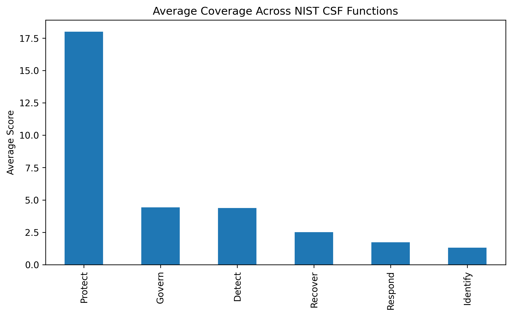
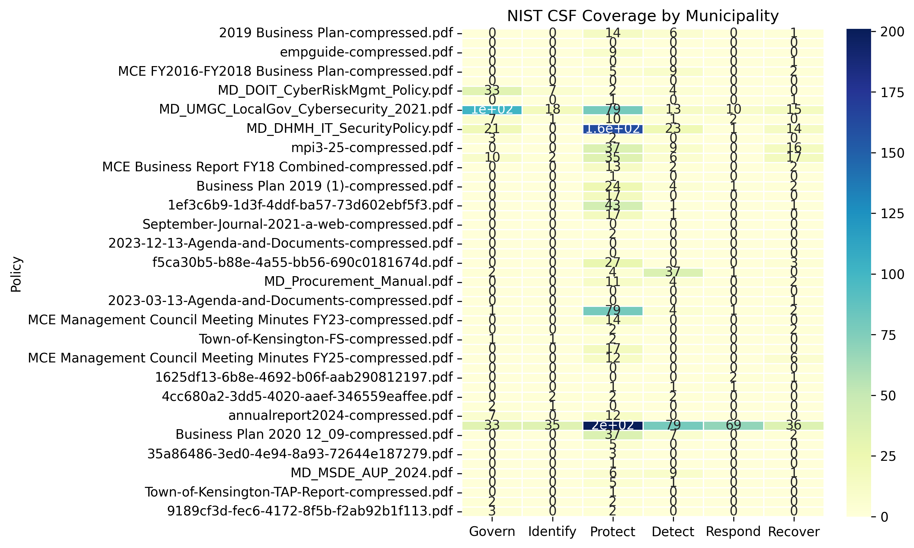
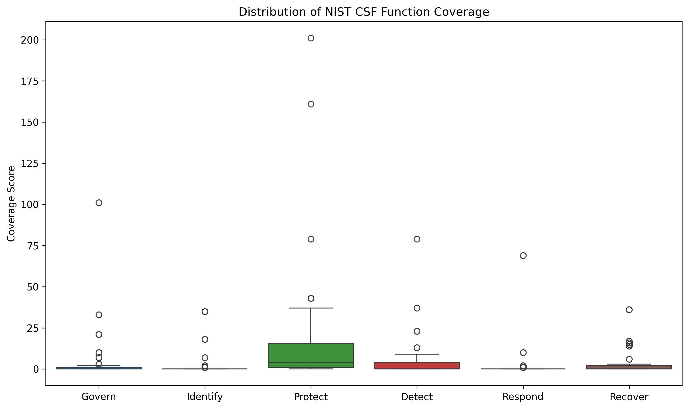
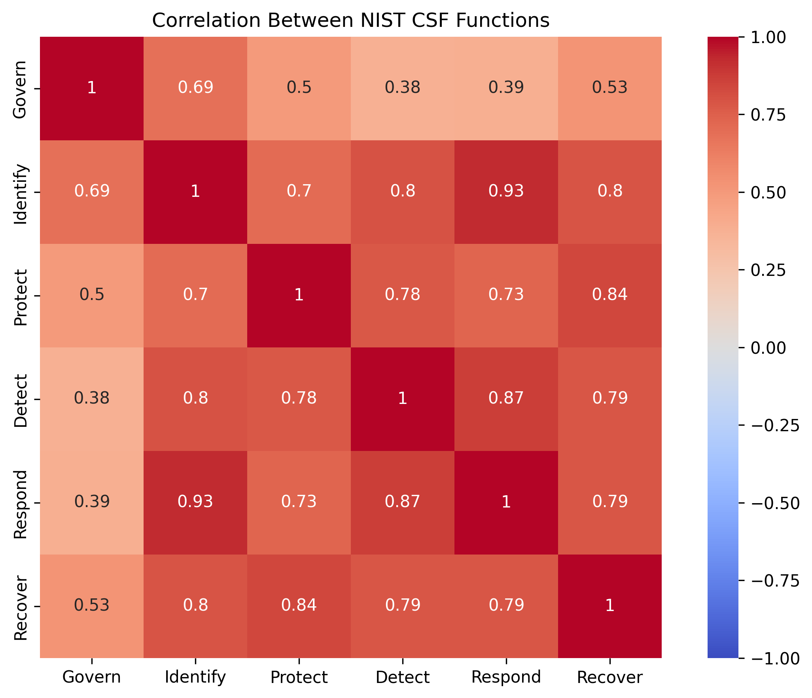
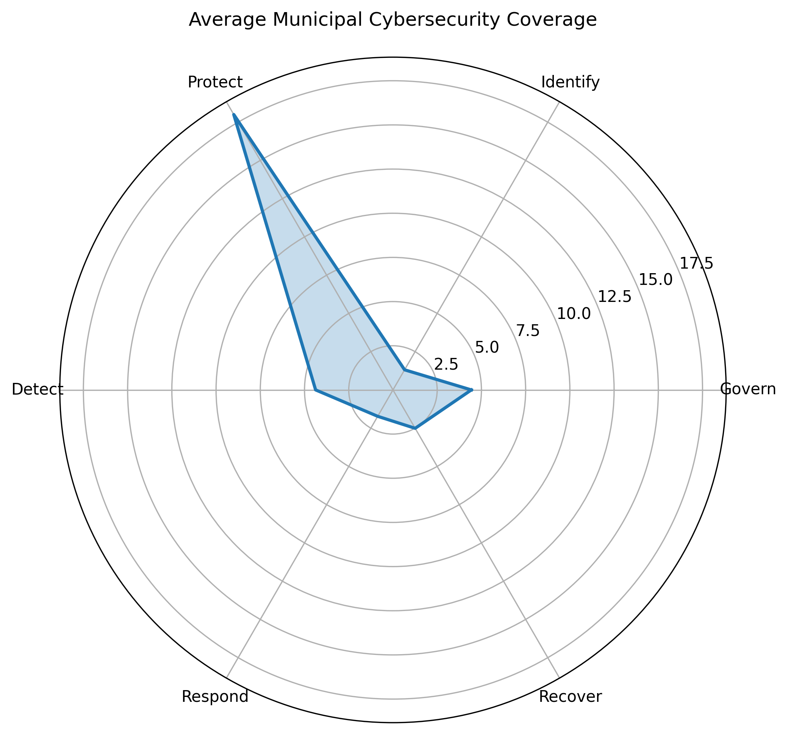
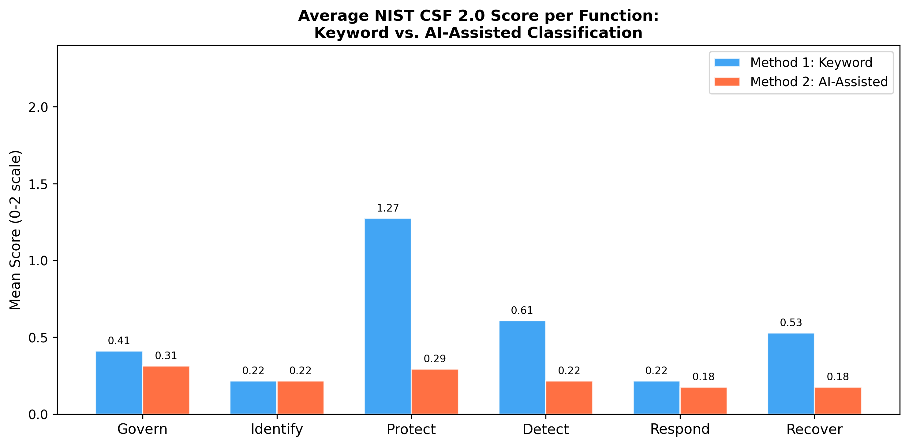
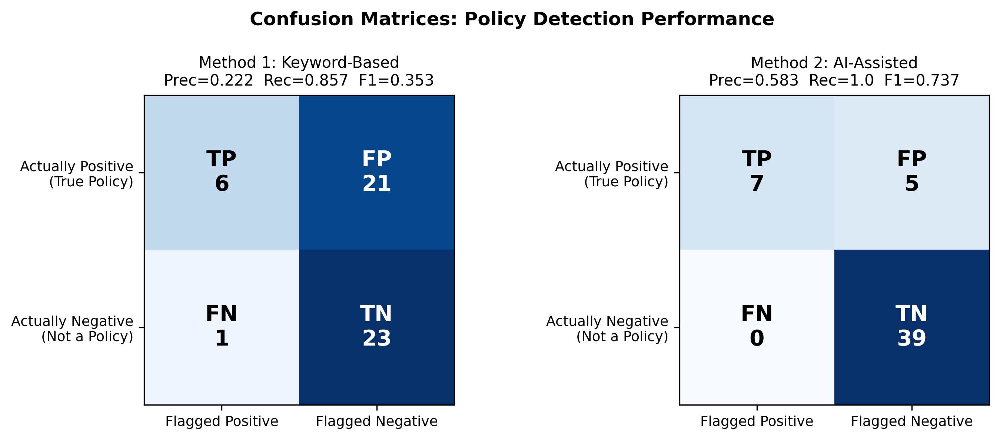
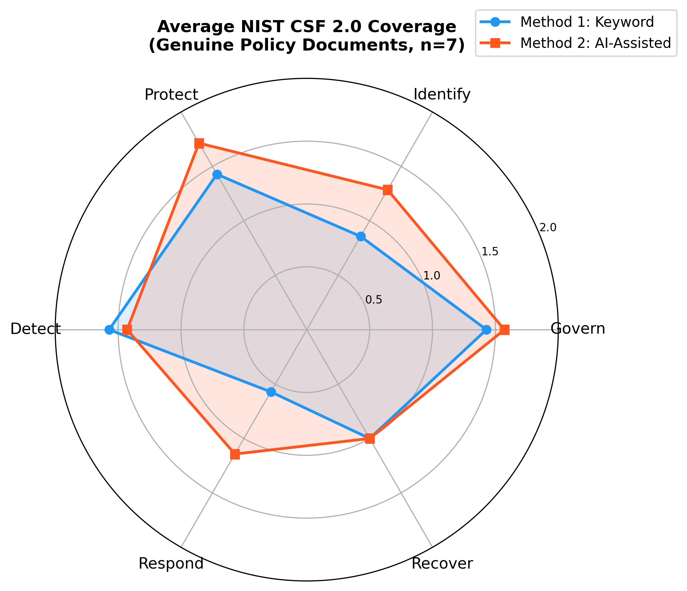
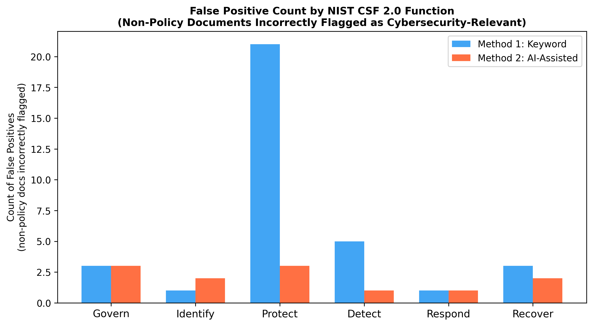
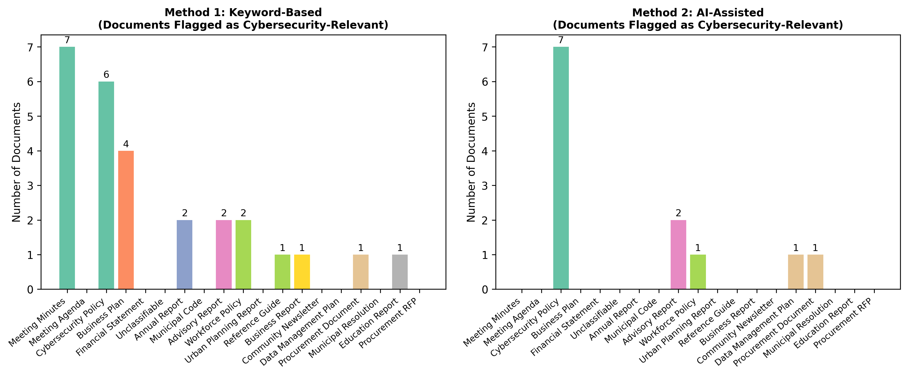

# Municipal Cybersecurity Policy Analytics

**Benchmarking Municipal Cybersecurity Readiness Through Automated Policy Analytics: Evidence from Maryland Local Governments**

A reproducible Python pipeline for evaluating local government cybersecurity policy coverage against the [NIST Cybersecurity Framework (CSF) 2.0](https://www.nist.gov/cyberframework). Two automated classification approaches are compared on a corpus of 51 publicly available Maryland government documents.

---

## Key Results

| Metric | Method 1: Keyword-Based | Method 2: AI-Assisted |
|---|---|---|
| True Positives | 6 | 7 |
| False Positives | 21 | 5 |
| False Negatives | 1 | 0 |
| Precision | 0.222 | 0.583 |
| Recall | 0.857 | 1.000 |
| F1 Score | 0.353 | 0.737 |
| Accuracy | 56.9% | 90.2% |

The AI-assisted approach reduces false positives by **76%** and achieves perfect recall. The Pearson correlation between keyword and AI scores for the Protect function is non-significant (r = 0.151, p = 0.291) — keyword matching on this dimension is dominated by the word *training* appearing in vocational and workforce documents with no cybersecurity content.

---

## Repository Structure

```
CCSC-E/
├── code/
│   ├── ai/
│   │   ├── ai_classify.py        # Method 2: NIST CSF 2.0 classification via LLM
│   │   └── compare_methods.py    # Method 1 vs Method 2 comparison + all charts
│   └── manual/
│       ├── policy_analysis.py    # Method 1: keyword-based NIST CSF scoring
│       ├── results.py            # Method 1 visualizations
│       └── keywords.json         # NIST CSF 2.0 keyword lists per function
├── policies/                     # 51 unique Maryland government PDFs
├── results/                      # All output figures (10 PNGs) and CSVs (6 files)
├── output/
│   ├── policy_scores.csv         # Keyword scores — Method 1
│   └── ai_scores.csv             # AI classification scores — Method 2
└── README.md
```

---

## Prerequisites

```bash
pip install pandas matplotlib seaborn scipy pymupdf anthropic
```

| Package | Purpose |
|---|---|
| `pymupdf` (fitz) | PDF text extraction |
| `pandas` | Data handling |
| `matplotlib` / `seaborn` | Visualization |
| `scipy` | Pearson correlation |
| `anthropic` | LLM API for Method 2 (requires API key) |

---

## Usage

Run all scripts from the **repository root**.

### Method 1 — Keyword-Based Analysis

```bash
# Score all 51 PDFs against NIST CSF 2.0 keyword lists
python code/manual/policy_analysis.py
# → output/policy_scores.csv

# Generate visualization charts
python code/manual/results.py
# → results/nist_heatmap.png, radar_chart.png, maturity_ranking.png, etc.
```

### Method 2 — AI-Assisted Classification

```bash
export ANTHROPIC_API_KEY=your_key_here

# Run LLM classification on all PDFs
python code/ai/ai_classify.py
# → output/ai_scores.csv

# Compare both methods and generate all comparison charts
python code/ai/compare_methods.py
# → results/method_comparison_bar.png, confusion_matrices.png, etc.
```

---

## Data Collection

51 documents collected via targeted Google dork searches (`site:md.gov`) and direct state agency downloads. Four exact duplicates were removed (verified by MD5 hash).

| Query | Retrieved |
|---|---|
| `site:md.gov filetype:pdf cybersecurity policy` | 3 |
| `site:md.gov filetype:pdf disaster recovery plan` | 7 |
| `site:md.gov filetype:pdf contractor cybersecurity` | 3 |
| `site:md.gov filetype:pdf incident response plan` | 7 |
| `site:md.gov filetype:pdf procurement policy` | 25 |
| Direct state agency downloads | 6 |
| **Total (after deduplication)** | **51** |

Of 51 documents, only **7 (13.7%)** are genuine cybersecurity or IT security policies. The remaining 44 are meeting agendas, financial statements, business plans, workforce reports, and other administrative documents — a key finding that motivates the AI-based approach.

---

## Results

### Method 1: Keyword-Based

**Average keyword score per NIST CSF function** — Protect is inflated 4× above all other functions by the word *training* appearing in non-cybersecurity documents.



**NIST CSF keyword heatmap across all 51 documents** — high scores on non-policy documents are clearly visible.



**Maturity ranking** — the Maryland WIOA Annual Report (workforce development) ranks 4th overall, ahead of three genuine cybersecurity policies.


**Distribution of coverage scores** — the Protect boxplot shows extreme outliers from false keyword matches.



**Correlation between NIST CSF functions** — high inter-function correlations are driven by the small set of genuine policies that address all functions.



**Radar chart** — the lopsided Protect spike illustrates imbalance from keyword noise.



---

### Method 2: AI-Assisted

**AI scores for the 7 genuine cybersecurity policies** — all correctly identified; Govern and Protect show consistent coverage; Detect and Recover show gaps.


---

### Method 1 vs. Method 2 Comparison

**Mean normalized score per NIST CSF function** — Protect diverges most sharply between methods.



**Confusion matrices** — Method 2 eliminates false negatives and cuts false positives from 21 to 5.



**Scatter plots: keyword vs. AI score per function** — points above the diagonal mean AI rates higher; below means keyword over-scores.


**Radar overlay: keyword vs. AI on genuine policies** — AI gives a more balanced and accurate coverage picture.



**False positives by NIST CSF function** — Protect accounts for 78% of all Method 1 false positives.



**Flagged documents by type** — Method 2 restricts flagging to cybersecurity-relevant documents.



---

## NIST CSF 2.0 Keyword Lists

Defined in `code/manual/keywords.json`:

| Function | Keywords |
|---|---|
| Govern | governance, risk management, cybersecurity strategy, board oversight, security program |
| Identify | asset inventory, risk assessment, business environment, critical systems |
| Protect | access control, authentication, encryption, training, firewall |
| Detect | monitoring, intrusion detection, logging, security event |
| Respond | incident response, containment, communication plan, response team |
| Recover | backup, disaster recovery, business continuity, restoration |

---

## Related Publications

**Conference Poster — CCSC-Eastern 2025**
> Despeignes, S., Huggins, T., & Trivedi, D. (2025). Evaluating the Impact of Cybersecurity Standards on Cyberattack Prevention. *Proceedings of the 2025 CCSC Eastern Conference*. ACM.
> https://dl.acm.org/doi/abs/10.5555/3801163.3801176

**Preprint**
> Local Government Supply Chain Cybersecurity: Addressing the Implementation Gap in Resource-Limited Municipalities.
> https://www.researchgate.net/publication/396960966_Local_Government_Supply_Chain_Cybersecurity_Addressing_the_Implementation_Gap_in_Resource-Limited_Municipalities

---

## License

MIT License. Policy documents in `policies/` are publicly available government records.
