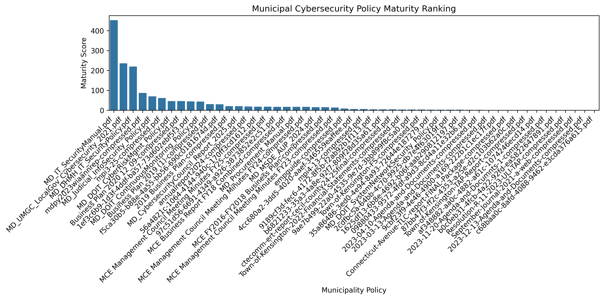
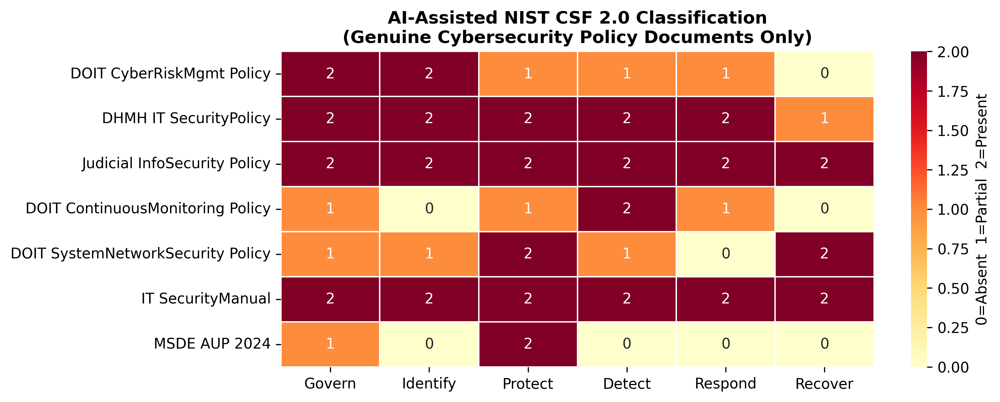
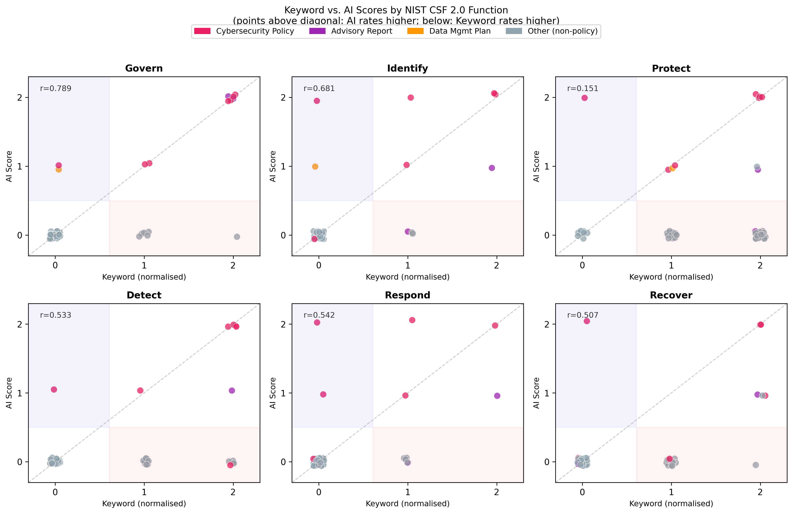

# Case Study: Maryland Local Government Corpus

This document describes how the `municipal-cyber-policy-analytics` tool was applied to a 51-document corpus of Maryland government PDFs as the primary validation study. It is intended as a worked example for researchers and practitioners who want to run the pipeline against their own jurisdiction.

---

## Overview

| Item | Value |
|---|---|
| Jurisdiction | State of Maryland (state agencies + municipalities) |
| Corpus size | 51 unique documents (after deduplication) |
| Collection method | Google dork searches + direct agency downloads |
| Framework | NIST Cybersecurity Framework (CSF) 2.0 |
| Methods compared | Keyword-based (Method 1) and AI-assisted (Method 2) |
| Ground truth positives | 7 genuine cybersecurity policy documents |
| Key finding | AI-assisted F1 = 0.737 vs. keyword F1 = 0.353 |

---

## Step 1: Corpus Construction

### Google Dork Searches

The corpus was assembled using targeted Google dork queries against the `site:md.gov` domain. A Google dork is an advanced search query that uses Google's search operators to filter results to a specific site, file type, or keyword combination. For example, the query `site:md.gov filetype:pdf cybersecurity policy` returns only PDF files hosted on `md.gov` that contain the phrase "cybersecurity policy."

The full list of queries used is in `dorks.csv` (excluded from version control as it is methodology-specific and not part of the tool's reusable code). The queries and their result counts are documented in [docs/methodology.md](methodology.md).

### Direct Agency Downloads

Six additional documents were downloaded directly from DOIT (Department of Information Technology), MSDE (Maryland State Department of Education), DHMH (Department of Health and Mental Hygiene), and the Maryland Judiciary cybersecurity policy pages after reviewing their public portals.

### Deduplication

Four exact duplicate files were identified by MD5 hash comparison and removed before processing.

---

## Step 2: Running the Pipeline

From the repository root:

```bash
# Install dependencies
pip install pandas matplotlib seaborn scipy pymupdf anthropic

# Method 1: keyword scoring
python code/manual/policy_analysis.py
# -> output/policy_scores.csv

# Method 1: generate charts
python code/manual/results.py
# -> results/average_coverage.png, nist_heatmap.png, maturity_ranking.png, etc.

# Method 2: AI classification
# Requires ANTHROPIC_API_KEY environment variable
export ANTHROPIC_API_KEY=your_key_here
python code/ai/ai_classify.py
# -> output/ai_scores.csv

# Method 2: comparison analysis
python code/ai/compare_methods.py
# -> results/method_comparison_bar.png, confusion_matrices.png, etc.
```

---

## Step 3: Corpus Findings

### Document Type Distribution

The most important finding from data collection is that broad domain-level searches return highly heterogeneous document types. Only 13.7% of collected documents were genuine cybersecurity policies.

| Category | Count | % |
|---|---|---|
| Cybersecurity / IT Security Policy | 7 | 13.7% |
| Meeting Agenda or Minutes | 15 | 29.4% |
| Business Plan or Report | 5 | 9.8% |
| Financial Statement | 4 | 7.8% |
| Government Policy (Non-Cyber) | 5 | 9.8% |
| Advisory / Analysis Report | 2 | 3.9% |
| Procurement / RFP Document | 2 | 3.9% |
| Unclassifiable / Scanned | 11 | 21.6% |
| **Total** | **51** | **100%** |

This heterogeneity is the central challenge for any automated classification method and is why keyword-based approaches perform poorly on this corpus.

### The 7 Genuine Cybersecurity Policies

| Document | Year | Issuing Body | Notes |
|---|---|---|---|
| MD IT Security Manual v1.2 | 2019 | DOIT | 200+ pages; most comprehensive in corpus |
| MD DHMH IT Security Policy v4.0 | 2014 | DHMH | Pre-CSF 2.0; still covers all 6 functions |
| MD Judicial Information Security Policy | 2026 | MD Judiciary | Explicitly cites NIST and CIS frameworks |
| MD DOIT Cyber Risk Management Policy | 2026 | DOIT | Introduces risk appetite and SCISO roles |
| MD DOIT Continuous Monitoring Policy | 2026 | DOIT | Maps to DE.CM and DE.AE in CSF 2.0 |
| MD DOIT System and Network Security Policy | 2026 | DOIT | Maps to PR.PS and PR.IR; includes resilience |
| MSDE Acceptable Use Policy v2.0 | 2024 | MSDE | Focus on Protect; no Detect/Respond/Recover |

All seven are publicly available Maryland government records.

---

## Step 4: Interpreting the Results

### Why Keyword Scores Fail on This Corpus

The keyword approach assigns the Maryland WIOA Annual Report -- a workforce development outcomes document -- a composite score of 87, placing it 4th in the maturity ranking ahead of three genuine cybersecurity policies. This happens because the keyword *training* appears hundreds of times in the document's discussion of job training programs, triggering the Protect function keyword list.



The MD DOIT System and Network Security Policy (2026) receives a keyword composite score of only 3 despite being a genuine, comprehensive cybersecurity policy. Its technical vocabulary (*configuration management*, *network segmentation*, *geographically dispersed architecture*) does not match any predefined keyword.

### Why AI Classification Succeeds

The AI correctly identifies the WIOA Annual Report as a workforce document with no cybersecurity content (all functions score 0). It correctly identifies the MD DOIT System and Network Security Policy as substantively covering Protect (PR = 2) and Recover (RC = 2) despite the vocabulary mismatch.



### The Protect Correlation Problem

The Pearson correlation between keyword and AI Protect scores is r = 0.151 (p = 0.291), which is not statistically significant. This is the paper's key statistical finding: for the Protect function, keyword counts carry no signal about genuine cybersecurity coverage. The correlation is driven entirely by noise from *training* appearing in non-security contexts.

For all other five functions, keyword and AI scores are significantly correlated (r > 0.5, p < 0.001).



---

## Step 5: Supply Chain Coverage

Supply chain keywords (*vendor*, *third party*, *supplier*, *contractor*, *service provider*, *supply chain*) appeared in 34 of 51 documents. However, AI classification confirmed that the vast majority of these appearances are in procurement and correctional enterprise documents, not cybersecurity policies.

Substantive supply chain cybersecurity provisions (imposing vendor security requirements, right-to-audit clauses, or incident notification obligations) were found in only 4 of 7 genuine cybersecurity policies -- and exclusively at the state level. No municipal-level supply chain cybersecurity requirements were found in the corpus.

This reflects the gap identified in the paper: Maryland municipalities that contract for cloud services, managed IT, or third-party software platforms have no public-facing contractual mechanism to mitigate supply chain risk comparable to SolarWinds (2020) or MOVEit (2023).

---

## Step 6: Applying This to Another Jurisdiction

To replicate this study for a different state or jurisdiction:

1. Replace `dorks.csv` with queries targeting your jurisdiction's domain (e.g., `site:texas.gov`, `site:nyc.gov`).
2. Place collected PDFs in `policies/`.
3. Run the pipeline as described in Step 2.
4. Assign ground truth labels in `code/ai/ai_classify.py` based on document review.
5. Run `code/ai/compare_methods.py` to generate comparison metrics.

The pipeline is designed to be jurisdiction-agnostic. The only Maryland-specific components are the document corpus in `policies/` and the ground truth labels in `ai_classify.py`.

---

## Output Files Reference

| File | Description |
|---|---|
| `output/policy_scores.csv` | Raw keyword hit counts per function per document |
| `output/ai_scores.csv` | AI scores (0/1/2) and reasoning per function per document |
| `results/full_comparison_table.csv` | Both methods side-by-side with ground truth labels |
| `results/detection_metrics.csv` | Precision, recall, F1, accuracy for each method |
| `results/method_comparison_by_category.csv` | Per-function means, standard deviations, Pearson r, p-values |
| `results/false_positive_analysis.csv` | False positive counts per function per method |
| `results/maturity_ranking.csv` | Documents ranked by composite score under each method |

---

## Key Figures

| Figure | File | Description |
|---|---|---|
| Average coverage | `results/average_coverage.png` | Mean keyword score per CSF function (n=51) |
| NIST heatmap | `results/nist_heatmap.png` | Per-document keyword scores across all functions |
| Maturity ranking | `results/maturity_ranking.png` | Top-ranked documents by composite keyword score |
| Coverage boxplot | `results/coverage_boxplot.png` | Score distribution per function (outlier visibility) |
| Correlation heatmap | `results/correlation_heatmap.png` | Inter-function Pearson correlations (keyword method) |
| Radar chart | `results/radar_chart.png` | Average coverage profile across six functions |
| AI heatmap | `results/ai_heatmap_policies.png` | AI scores on the 7 genuine policies only |
| Method comparison | `results/method_comparison_bar.png` | Mean normalized scores: keyword vs. AI per function |
| Confusion matrices | `results/confusion_matrices.png` | TP/FP/FN/TN for both methods |
| Scatter KW vs AI | `results/scatter_kw_vs_ai.png` | Per-function scatter of keyword score vs. AI score |
| Radar overlay | `results/radar_kw_vs_ai.png` | Keyword vs. AI coverage profile on genuine policies |
| False positive bar | `results/false_positive_comparison.png` | False positives per function per method |
| Flagged by doc type | `results/flagged_by_doctype.png` | What document types each method flags as positive |
